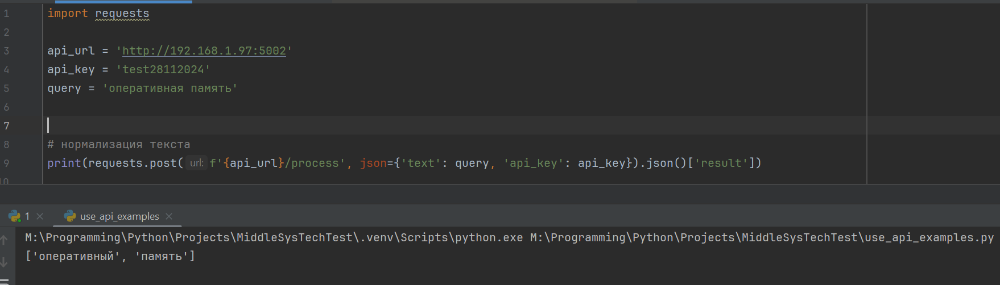
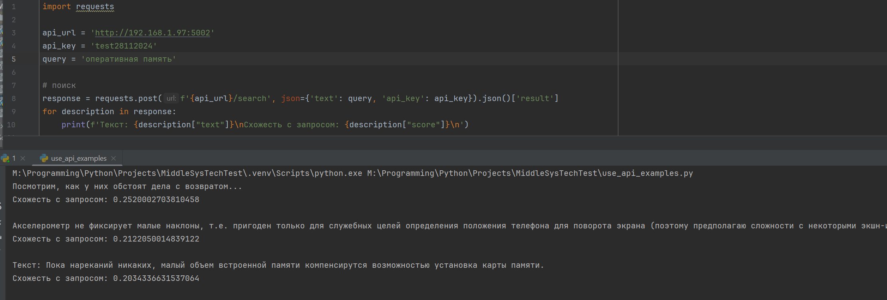

### Тестовое задание: упрощенный RAG

---
Приложение представляет собой REST API, позволяет получить нормализованный текст по маршруту /process и результаты поиска по маршруту /search.
Для создания базы текстов поиска использовались отзывы на мобильные телефоны (1000 записей из датасета https://www.kaggle.com/datasets/theovall/phonereviews), язык текстов - русский

##### Установка
Для установки приложения используйте следующие команды:
- pip install -r requirements.txt
- python -m spacy download ru_core_news_sm

При тестировании приложения использовался python v 3.10.6

##### Запуск
Для запуска используйте команду: python app.py

---
##### Примеры:
1. Обработка текстового запроса

2. Поиск по отзывам 

---
##### Структура проекта:
app.py - основной код приложения

use_api_examples.py - скрипт для тестирования API

data.json - база текстов для поиска

requirements.txt - список необходимых сторонних пакетов для работы приложения
